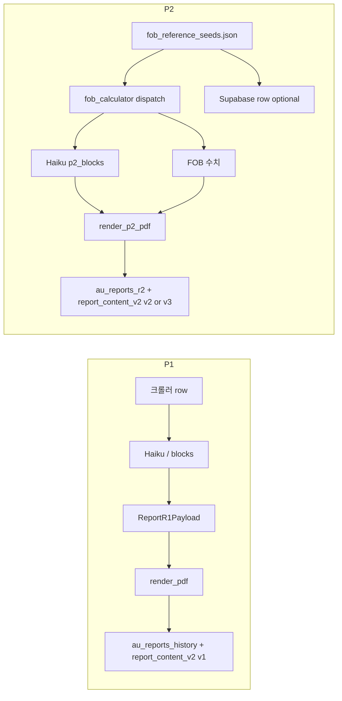

# 호주 UPharma — 보고서 스키마 맵 (정리본)

> **목적:** 시장분석(P1)·수출전략(P2)·DB·`report_content_v2`·Stage2 시드가 섞여 보이는 문제를 줄이기 위해, **“무엇이 어디에 정의되는지”**만 한곳에 모았습니다.  
> **진실의 소스(우선순위):** Pydantic 모델 / `fob_calculator` 반환 구조 / 실제 `render_api` upsert 필드. 아래 “주의(중복)”를 참고하세요.

---

## 1) 한눈에: 보고서 종류 × 저장 위치

| 구분 | 산출물 | 주요 Supabase 테이블 | JSON 봉투 (`report_content_v2`) | 코드(스키마 정의) |
|------|--------|----------------------|----------------------------------|-------------------|
| **P1 시장분석** | PDF + 이력 | `au_reports_history` (gong=1) | `schema_ver: 1`, `report_kind: "market_analysis"` | `stage1_schema.py` — `ReportR1Payload`, `MarketAnalysisV8` |
| **P2 수출전략 (단일 세그먼트)** | API 응답 + PDF | `au_reports_r2` (`product_id` + `segment`) | `schema_ver: 2`, `report_kind: "export_strategy"` | `render_api.py` upsert, `_haiku_p2_blocks` / `_claude_p2_blocks_schema` |
| **P2 수출전략 (공+민 이중)** | 2행 upsert + PDF 2개 | 동일 `au_reports_r2` | `schema_ver: 3`, `report_kind: "export_strategy_dual"` | 위 + `dispatch_both_segments` 루프 |
| **P2 blocked** (역산 차단) | 경고만 | `au_reports_r2` | `schema_ver: 1`, `report_kind: "export_strategy"`, `blocked: true` | `render_api.py` blocked 분기 |

**구분 키:** `report_content_v2.report_kind` + (P2는) `schema_ver`.  
`schema_ver`만으로는 **P1과 P2 blocked 둘 다 1**이 될 수 있으므로, 반드시 **`report_kind`를 함께** 봅니다.

---

## 2) `report_content_v2` 버전 요약

| schema_ver | report_kind | 의미 |
|------------|-------------|------|
| **1** | `market_analysis` | P1: `blocks`(v8 또는 레거시 flat), `refs`, `meta` … (`render_api._append_au_reports_history_market_analysis`) |
| **1** | `export_strategy` + `blocked: true` | P2: dispatch가 `logic=="blocked"`일 때 스냅샷 (전체 문장용 필드는 비어 있을 수 있음) |
| **2** | `export_strategy` | P2 단일 세그먼트: `p2_blocks`, `export_strategy_v5`, `fx_rates`, `dispatch_logic` 등 |
| **3** | `export_strategy_dual` | P2 공·민 각각의 행: `p2_blocks`는 **해당 segment** 것, `available_segments`로 전체 맥락 |

**프론트/백엔드 계약:** 상세 키 목록은 `render_api.py`에서 `jsonable_encoder({...})`로 넣는 dict를 **소스 오브 트루스**로 보는 것이 안전합니다.

---

## 3) P1 (시장분석) — 본문 구조

### 3.1 PDF / API용 통합 페이로드: `ReportR1Payload` (`stage1_schema.py`)

- **헤더:** `product_name`, `inn`, `strength_form`, `hs_code`, `report_date`
- **판정:** `verdict`, `verdict_summary`, `basis_*`, `strat_*`
- **v8 (권장):** `v8_market_analysis: dict` — 내부는 `MarketAnalysisV8`와 동일 계층 (`verdict`, `market_overview`, … `references`)

### 3.2 v8 ↔ 레거시 `block2_*` / `block3_*` / `block4_*`

- `flatten_v8_to_legacy_blocks()` 가 v8 → 구 flat 키로 변환 (프론트·기존 DB 필드 호환).
- v8 판별: `is_v8_market_blocks(blocks)` — `verdict`가 dict이고 `market_overview` 존재.

---

## 4) P2 (수출전략) — 본문·숫자·AI 블록

### 4.1 계산(비 LLM): `stage2/fob_calculator.py`

- **입력 시드:** `stage2/fob_reference_seeds.json` (`_schema_version`, `pricing_case`, 참고 AEMP/소매가, 플래그 … — 파일 상단 `_schema_notes` 참고).
- **출력 dispatch:** `dispatch_by_pricing_case` / `dispatch_both_segments` — `scenarios.{aggressive|average|conservative}`에 `fob_aud`, `fob_krw` 등.  
  PDF 4절 FOB 표는 **이 dict**를 기준으로 그립니다 (LLM이 숫자를 “만들지” 않음).

### 4.2 LLM 9필드: `p2_blocks` (키 이름 고정)

`render_api._claude_p2_blocks_schema()` / `_haiku_p2_blocks`와 동일:

| 키 | 용도(요지) |
|----|------------|
| `block_market_macro` | 1. 국가 거시 시장 |
| `block_extract` | 2. 단가(시장기준가) 요약·근거 |
| `block_fob_intro` | 3시나리오 FOB 메타 설명 |
| `scenario_penetration` | 저가 시나리오 (aggressive `fob_aud` 인용) |
| `scenario_reference` | 기준 시나리오 (average) |
| `scenario_premium` | 프리미엄 (conservative) |
| `block_strategy` | 진입 전략 |
| `block_risks` | 리스크 |
| `block_positioning` | 경쟁 포지셔닝 |

### 4.3 `au_reports_r2` flat 컬럼과의 관계

- 마이그레이션 `scripts/migrations/20260422_schema_converge_safe.sql` 등으로 **FOB·시나리오 문장·경고**가 컬럼에도 펼쳐짐 (쿼리/대시보드용).
- **`p2_blocks` 전체(특히 `block_market_macro`)는 `report_content_v2.p2_blocks`에 항상 들어가는 것이 맞고**, flat 쪽은 **일부 키만** 복제될 수 있음 — **상세는 항상 JSONB**를 우선 확인.

---

## 5) Mermaid: 데이터 흐름 (요약)

---

## 6) 파일·모듈 인덱스 (스키마를 볼 때 열 곳)

| 주제 | 경로 |
|------|------|
| P1 Pydantic | `upharma-au/stage1_schema.py` |
| P1 PDF | `upharma-au/report_generator.py` (`render_pdf` 계열) |
| P2 PDF | `upharma-au/report_generator.py` (`render_p2_pdf`, `_SCENARIO_LABELS`) |
| P2 API + DB 저장 + `report_content_v2` 조립 | `upharma-au/render_api.py` |
| FOB·dispatch | `upharma-au/stage2/fob_calculator.py` |
| 시드 JSON 스키마 설명 | `upharma-au/stage2/fob_reference_seeds.json` (`_schema_notes`) |
| DDL (report_content_v2, au_reports_r2 컬럼) | `scripts/migrations/20260420_report_content_v2.sql`, `20260422_schema_converge_safe.sql` |

---

## 7) 유지보수 시 “헷갈리지 않기” 체크리스트

1. **새 P2 필드 추가** → `_claude_p2_blocks_schema` + Haiku tool + (필요 시) `au_reports_r2` 컬럼 + `report_content_v2` + `render_p2_pdf` 중 어디에 붙일지 **한 번에** 정하기.
2. **schema_ver 변경** → 기존 `(report_kind, schema_ver)` 조합을 문서·프론트가 같이 읽는지 확인.
3. **P1 v8 vs flat** → `flatten_v8_to_legacy_blocks`를 깨지 않는지 확인.
4. **이중 P2** → `segment`당 한 행; PDF는 `dispatch_public`/`dispatch_private`로 4-1/4-2 표 분리(코드 주석 참고).

---

*최초 정리: 2026-04-23. 코드와 불일치 시 **코드(`render_api`·마이그레이션)를 기준**으로 이 문서를 갱신하세요.*
